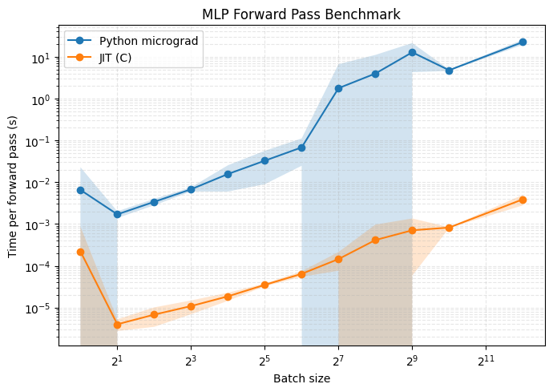
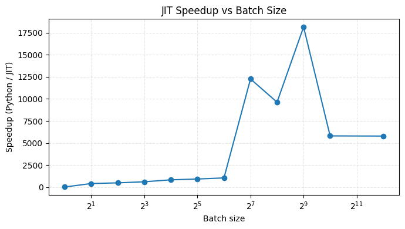

# micrograd-jit

A tiny JIT compiler built on top of the micrograd engine.

### Installation

```bash
git clone https://github.com/danielecursano/micrograd-jit.git
cd micrograd-jit && pip install -e .
```

### Example usage 

```python
import numpy as np
from micrograd_jit import MLP, jit 

batch_size = 32
X = np.random.normal(size=(batch_size, 2))
model = MLP(2, [16, 16, 1]) # 2-layer neural network

def forward(x, y):
    return model([x, y])

jit_function = jit(forward)
output = list(map(jit_function, X))
```

### Benchmark

See ```benchmark.ipynb``` for a comparison of Python execution vs. JIT-compiled code. It highlights the performance improvements achievable with the JIT.





### License

MIT
